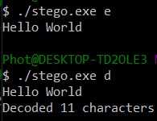
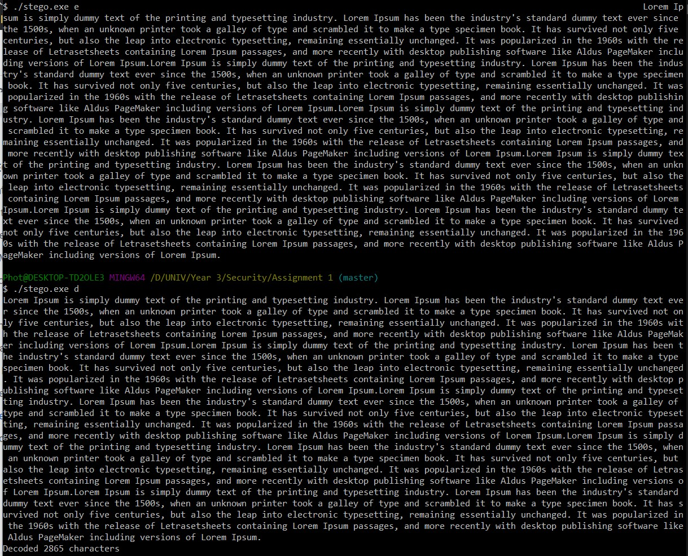

# STEGANOGRAPHY - Hiding Texts Inside an Image

###### Steganography is the practice of concealing a file, message, image, or video within another file, message, image, or video. ​Generally, the hidden messages appear to be part of something else.


### _It is important that you read the report!_


##### Getting Started
*Cloning repository*
```sh
$ git clone https://github.com/sophot/steganography.git
$ cd steganography
```
*Compile and Execute with gcc (or any compiler you like)*
```sh
$ gcc main.c -0 stego
-Encode-
$ ./stego.exe e (for window)
$ ./stego.out e (for mac)
-Decode-
$./stego.exe d
```

##### Demo
<p align="center">
  
</p>

<p align="center">
  
</p>
